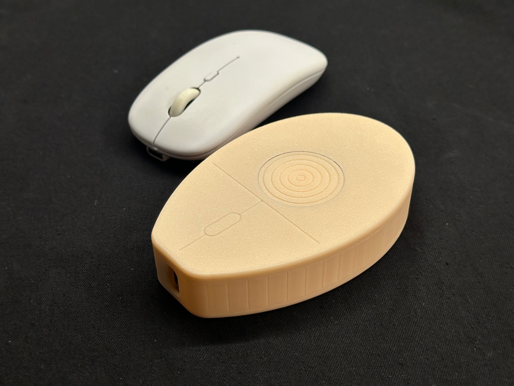
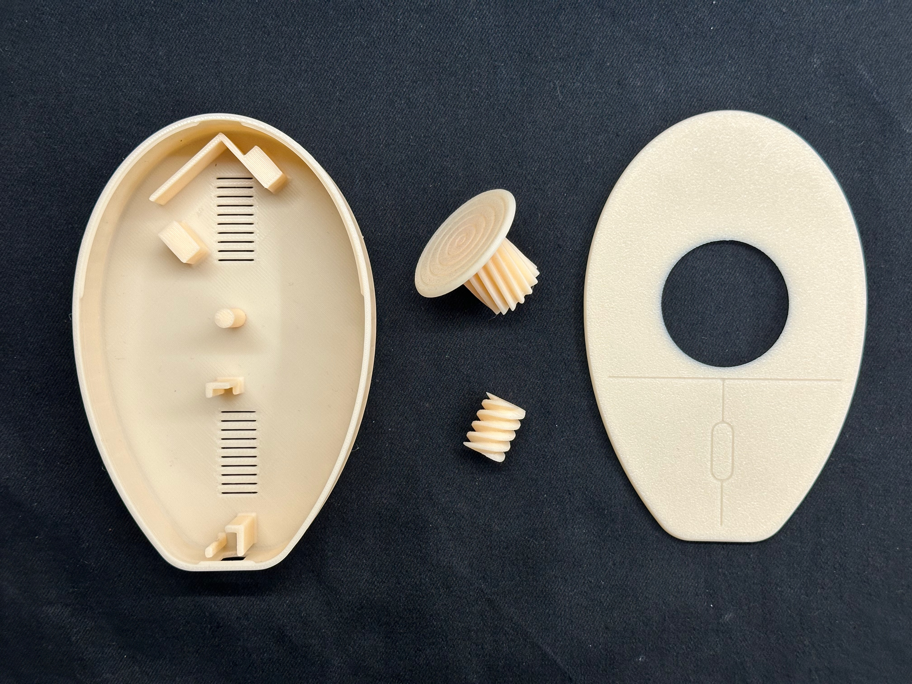
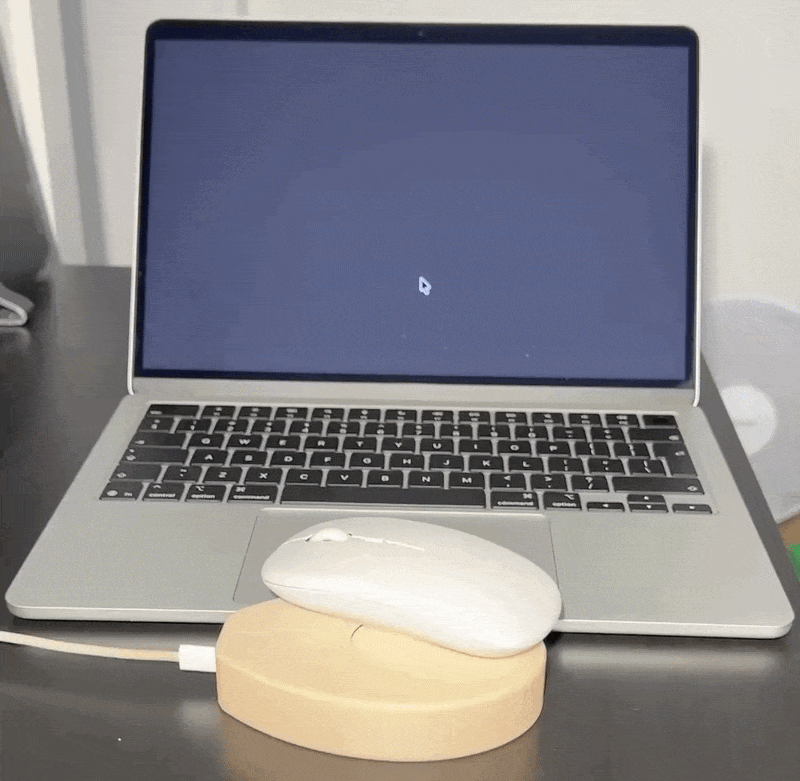

# JiggleMouse 🖱️

**JiggleMouse** is an undetectable, physical hardware solution designed to keep your computer awake. Whether you are waiting for a massive 3D render to finish, downloading a huge game overnight, or simply stepping away without your corporate chat switching to "Away," this open-source tool has your back.

Because it physically moves your real mouse's optical sensor, it leaves **zero digital footprint**. There are no suspicious USB HID drivers, background apps, or scripts for IT departments to flag. It is extremely easy to build, set up, and start using immediately.

---

## ⚙️ How It Works

*   **The Brains:** An Arduino Nano sends precise control signals to a servo motor. You can fully customize the rotation speed, direction, and pause intervals directly from your browser.
*   **The Mechanism:** The servo spins a 3D-printed worm gear. This worm gear continuously drives a larger involute gear, rotating a flat jiggler disk mounted on a central rod.
*   **The Clearance:** The spinning disk is engineered to sit a fraction of a millimeter below the top lid. This tiny offset ensures the rotating plastic never rubs against or scratches the bottom of your mouse.
*   **The Illusion:** When you place your mouse on top, its optical sensor detects the surface of the spinning disk. The mouse interprets this moving pattern as actual physical travel, sending standard movement signals to your PC and moving your cursor across the screen!

---

## 🛠️ Required Hardware

You only need two affordable electronic components to bring this to life:
1.  **Arduino Nano** (Type-C version highly recommended).
2.  **SG90 360° Servo Motor** (⚠️ *Crucial:* It MUST be a 360-degree continuous rotation servo, not a standard 180-degree model).
3.  **Male-to-Female Jumper Wires** (Zero soldering required, though you can solder the connections for a permanent build).

---

## 🖨️ 3D Printed Parts

This model is highly optimized for a hassle-free printing experience. The entire device consists of only **4 printed parts** and prints easily with **absolutely no supports**. Everything is designed to snap together with a secure friction fit, meaning you do not need any screws, nuts, or extra hardware.

👉 **[Download the STL/3MF files on MakerWorld](INSERT_MAKERWORLD_LINK_HERE)**

---

## 🚀 Firmware Installation

You do not need to know how to code to build this project! You can install the firmware in one click using the custom Web Flasher.

### Option 1: Web Flasher (Recommended)
1. Go to the **[JiggleMouse Project Page](INSERT_GITHUB_PAGES_LINK_HERE)** (Requires a Chromium browser like Chrome or Edge).
2. Connect your Arduino Nano to your PC using a USB **data** cable.
3. Click **Flash Nano** in the "Install Firmware" section.
4. Once flashed, use the Control Panel on the same webpage to customize your rotation speeds, spin times, pause intervals, and boot preferences.

### Option 2: Compile via Arduino IDE
If you prefer to compile the code manually or want to tinker with the firmware:
1. Clone this repository.
2. Open `JiggleMouseArduino.ino` in the Arduino IDE.
3. **Libraries Required:** None! The code relies entirely on the standard, built-in `<Servo.h>` and `<EEPROM.h>` libraries. Zero external library downloads are required.
4. Select **Arduino Nano** under `Tools > Board`. (Note: If upload fails on a clone board, toggle the Processor to `ATmega328P (Old Bootloader)`).
5. Click Upload.

---

## 📝 License
This project is open-source and available under the [MIT License](LICENSE).